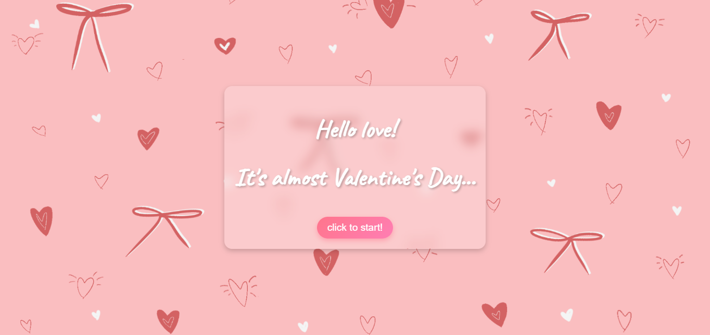
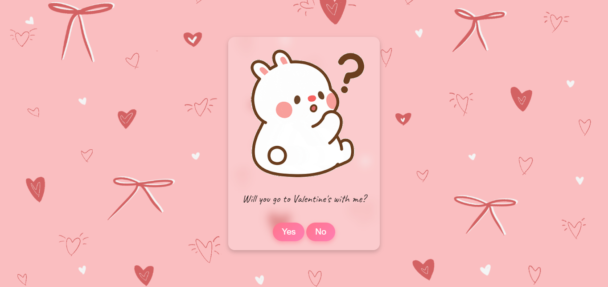
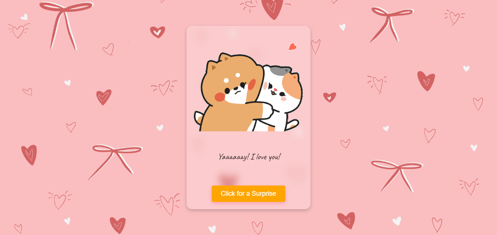

# ❤️ Valentine Surprise

An interactive web-based **Valentine's Day surprise** that lets users open a virtual envelope, view a heartfelt message, and receive a planned itinerary. Designed with **HTML, CSS, and JavaScript**, this project brings a personal touch to digital surprises.

---

## 📸 Screenshots

Here are some previews of the project:





---

## 🎯 Features
✔️ **Animated envelope** that opens when clicked  
✔️ **Personalized message** with dynamic interaction  
✔️ **Yes/No prompt** for Valentine’s invitation  
✔️ **Planned itinerary** with a downloadable PNG  
✔️ **Fully responsive design**  

## 📜 License
This project is not available for commercial use.
For personal and educational purposes only.


---

## 🚀 Getting Started

### 1. Open index.html
Simply open index.html in a browser—no installation required.

### **2. Clone the Repository**
```sh
git clone https://github.com/your-username/valentine-surprise.git
cd valentine-surprise
